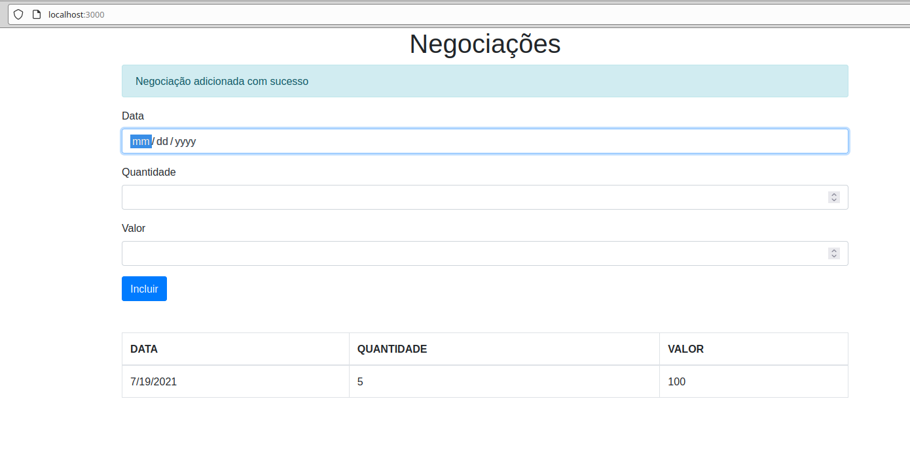

## Configurações da API

O projeto consiste no aprendizado do TypeScript (POO) com 3 inputs de dados e sua impressão em uma tabela.


## Instalar Pacotes
```
yarn install
```

## Executar API
Processo é executado por padrão na porta 3000 -> localhost:3000
```
yarn run server
```

## Compilar
```
yarn run compile
```

## Compilar em Tempo Real
```
yarn run watch
```

## Parametros 
```
Data: Date;
Quantidade: number;
Valor: number;
```


## Demonstração

Realizada na mesma tela (SP) abaixo dos inputs

<p align="center"></p>

